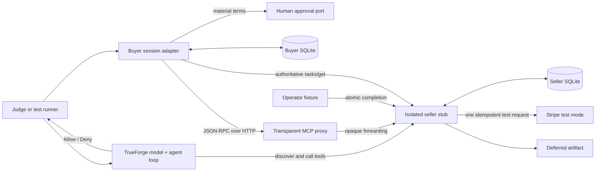

# Artiji Buyer Agent

> An evidence-first buyer-side experiment for paid, deferred MCP tasks.

Most payment demos stop when a charge succeeds. Most task demos start after work has already been authorized. This repository tests the seam between them: an agent discovers a paid tool, sees the material terms, crosses a human approval boundary, pays exactly once, survives process death, resumes a durable task, and verifies that the delivered artifact belongs to the order it paid for.

The goal is not a polished storefront or a claim of production readiness. The goal is a reproducible answer to a narrower question:

**Does MPP-over-MCP compose cleanly with MCP Tasks when payment completes now but fulfillment happens days later?**

The honest answer from this implementation is mixed:

- The runtime flow can work with disciplined persistence and correlation rules.
- Standard MCP discovery did not carry any of the six structured material-term categories this buyer required before payment.
- The consulted MPP-over-MCP and MCP Tasks drafts did not say that a receipt returned beside a `CreateTaskResult` applies to that task, or require preserving it during the task lifecycle.
- The implementation can demonstrate a safe local rule for that gap, but one implementation is not interoperability proof.

This is a private evaluation repository. It contains synthetic data, test-mode payment evidence, redacted traces, explicit limitations, and no Artiji production code or credentials.

## Five-minute judge path

Prerequisite: Node.js 22.14 or newer.

```sh
node --version
npm test
```

Expected result: **20 tests pass** with no package installation and no external service required.

Then inspect, in order:

1. [`vectors/deferred-task-flow.json`](vectors/deferred-task-flow.json) — five byte-exact request/response pairs and SHA-256 digests.
2. [`docs/extension-audit.md`](docs/extension-audit.md) — why all six disclosure categories ended up in `xyz.artiji/commerce`.
3. [`docs/gap-log.md`](docs/gap-log.md) — the append-only record of every point where the specifications forced a choice.
4. [`docs/upstream-diff.md`](docs/upstream-diff.md) — the minimal proposed receipt-to-task rule; no new receipt fields and no MPP core change.
5. [`docs/limitations.md`](docs/limitations.md) — what is not implemented and what the evidence must not be used to claim.

The phase-by-phase audit trail is in [`docs/phase-reports/`](docs/phase-reports/).

## The problem being solved

A buyer of a deferred agent service needs more than a successful payment response. Before authorizing payment, it needs to know:

- What does it cost?
- Is fulfillment immediate, automated, or manual?
- When should the result arrive?
- What kind of result is being purchased?
- What is the refund policy?
- Can the order be cancelled?

After payment, it needs durable answers to a different set of questions:

- Did a retry create a second charge?
- Does the receipt belong to the returned asynchronous task?
- Can a new process resume after the original buyer dies?
- Is a notification authoritative, or merely a reason to poll?
- Does the completed artifact belong to this payment rather than some other order?
- Which claims are specified, which are implementation choices, and which are only true in this test?

MPP supplies payment challenge and receipt semantics. MCP supplies tools and durable tasks. Their composition leaves important buyer-facing behavior to implementations. This repository turns those seams into executable tests and reviewable evidence.

## Demonstrated scenario

The sole offer is deliberately fixed:

| Property | Value |
| --- | --- |
| Tool | `order_reading` |
| SKU | `individual` |
| Price | USD 150.00 (`15000` minor units) |
| Fulfillment | Manual, deferred |
| Expected window | 3–5 days |
| Result | Full chart analysis artifact |
| Data | Synthetic subject only |
| Payment rail | Stripe test mode |

The seller is a new local stub. It mirrors only the bounded domain shape needed for the experiment. It does not import Artiji code, connect to Artiji data, call Artiji paid endpoints, or share production credentials.

## Architecture



### Component responsibilities

| Component | Responsibility |
| --- | --- |
| [`buyer/harness-session.js`](buyer/harness-session.js) | Reads material terms, reaches the approval port, persists paid state, validates current MCP task fields, treats `tasks/get` as authoritative, and verifies receipt/artifact correlation. |
| [`buyer/state-store.js`](buyer/state-store.js) | Stores the buyer's idempotency key, receipt, task capability, payer material, and update time in SQLite so another process can resume. |
| [`seller/seller-stub.js`](seller/seller-stub.js) | Exposes the fixed offer, emits the payment challenge, enforces the Tasks client capability, creates the paid task, and serializes creation and polling results. |
| [`seller/mcp-http-server.js`](seller/mcp-http-server.js) | Implements MCP initialization, session IDs, initialized notifications, tool discovery, tool calls, raw `tasks/get`, safe loopback-origin handling, and human-readable diagnostics. Its agent bridge exposes experimental payment/task behavior through ordinary tools for generic harnesses. |
| [`seller/store.js`](seller/store.js) | Enforces database-level uniqueness, request fingerprinting, durable receipt-to-task binding, task lifecycle timestamps, and atomic completion. |
| [`seller/stripe-client.js`](seller/stripe-client.js) | Calls Stripe only with an `sk_test_` key and a deterministic server-side idempotency key. |
| [`gateway/observability-proxy.js`](gateway/observability-proxy.js) | Transparently forwards MCP traffic and routing headers while recording redacted protocol summaries and body hashes. It intentionally does not pretend to understand MPP semantics. |
| [`seller/operator-fixture.js`](seller/operator-fixture.js) | Publishes a synthetic artifact and binds its identity and payment reference before the task becomes `completed`. |
| [`shared/mcp-tasks.js`](shared/mcp-tasks.js) | Defines the Tasks capability metadata and required polling routing headers shared by clients and fixtures. |

TrueForge can run the live model/tool loop against the local MCP server and own the visible human checkpoint. The deterministic suite still requires neither TrueForge nor a configured model provider. See [`trueforge/README.md`](trueforge/README.md).

The project also has a deliberately narrower cloud demonstration in TrueFoundry. A saved `artiji-buyer-agent` uses `openai/gpt-4.1-mini` to discover and call a TrueFoundry-hosted STDIO MCP server named `artiji-commerce`. That cloud tool only inspects the offer; the local TrueForge path remains the demonstration that performs the synthetic approval, payment, deferred-task, restart, and artifact flow.

## End-to-end lifecycle

1. The buyer inspects the tool before payment.
2. It requires all six structured material-term categories and checks that the same terms are visible in the tool description.
3. The USD 150 purchase crosses an injected human-approval port because it exceeds the USD 100 threshold.
4. A `tools/call` declaring `io.modelcontextprotocol/tasks` receives HTTP 200 containing JSON-RPC error `-32042`; `error.data.httpStatus` is 402 and carries the payment challenge.
5. The retry includes the payment credential and the same buyer-owned logical-purchase idempotency key.
6. The seller confirms one Stripe test-mode PaymentIntent using a deterministic Stripe idempotency key.
7. In one SQLite transaction, the seller stores the payment reference, task, receipt, receipt-to-task relationship, and byte-exact JSON-RPC success.
8. Only after `tasks/get` can resolve the durable task does the seller return HTTP 200 with `resultType: "task"` and `org.paymentauth/receipt`.
9. The buyer persists the receipt, task ID, idempotency key, and payer material before doing anything else.
10. Replaying the same logical purchase returns the exact stored response bytes and makes no second provider request. Reusing the key with a different request fingerprint fails.
11. The paid buyer process is terminated with `SIGKILL`.
12. A different process loads only the buyer SQLite state and resumes with `tasks/get`, sending `Mcp-Method` and `Mcp-Name`.
13. Every poll must return `resultType: "complete"`, current task lifecycle fields, the expected task ID, and the same receipt values.
14. Notifications, when simulated, are wake-up hints only. The buyer polls again before trusting state.
15. The operator atomically binds artifact identity, URL, and `orderReference` before marking the task complete.
16. The buyer accepts completion only when the terminal `CallToolResult` contains a matching resource link and the artifact's `orderReference` equals the payment receipt reference.

The human-approval adapter and the live Stripe script are deliberately separate demonstrations. The repository does not claim that a TrueForge UI approval was wired into the one-off live Stripe trace.

## Invariants and where they are enforced

| Invariant | Enforcement | Evidence |
| --- | --- | --- |
| Material terms precede payment | Buyer rejects missing structured fields or description text before approval | [`test/terms-visible-before-payment.test.js`](test/terms-visible-before-payment.test.js) |
| Human authority remains explicit | Purchases above `10000` minor units call an injected approval port | Same test file; [`buyer/approval-gate.js`](buyer/approval-gate.js) |
| Test mode only | Seller rejects any secret key without the `sk_test_` prefix | [`seller/config.js`](seller/config.js), [`test/p1-contracts.test.js`](test/p1-contracts.test.js) |
| One logical purchase, one provider attempt | `UNIQUE(merchant_id, idempotency_key)`, canonical fingerprint, deterministic Stripe idempotency key | [`test/idempotency.test.js`](test/idempotency.test.js) |
| No phantom asynchronous work | Task and receipt commit before success; a fresh lookup must resolve the task ID | [`docs/seller-durability.md`](docs/seller-durability.md) |
| Replay is stable | Stored success body is returned byte-for-byte | [`vectors/deferred-task-flow.json`](vectors/deferred-task-flow.json) |
| Buyer state survives process death | Paid state is committed before `SIGKILL`; a separate process resumes | [`test/restart-resume.test.js`](test/restart-resume.test.js), [`traces/p4-cold-restart.json`](traces/p4-cold-restart.json) |
| Receipt remains correlated | Buyer compares the receipt on every authoritative poll and rejects changes | Same P4 test and trace |
| Delivery belongs to the order | Artifact reference must equal the receipt reference; null or mismatched artifacts fail | Same P4 test |
| Capabilities are treated as authority | Task IDs are 256-bit bearer capabilities and are hashed in ordinary traces | [`docs/claim-security.md`](docs/claim-security.md) |
| Claims remain proportional to evidence | Every gap carries a source tier and invalidation condition; limitations are first-class | [`docs/gap-log.md`](docs/gap-log.md), [`docs/limitations.md`](docs/limitations.md) |

## Principal findings

### 1. Discovery needed six custom categories

The buyer required six categories before approval and found no standard MCP tool-discovery slot or normative MPP-discovery-to-MCP mapping for them:

```text
price
fulfillmentMode
expectedWindow
resultType
refundPolicy
cancellationPolicy
```

All six therefore appear under `xyz.artiji/commerce` and are duplicated in the tool description. The categories are general buyer needs; the actual price, timing, result, and policy values remain merchant choices. The detailed classification is in [`docs/extension-audit.md`](docs/extension-audit.md).

### 2. Receipt-to-task lifecycle binding was not specified

In the consulted drafts, the successful paid response can contain both a receipt and `CreateTaskResult`, but no rule says that the receipt applies to that `taskId` or requires the same receipt values on later `tasks/get` and `notifications/tasks` messages.

The implementation deliberately supplies that missing rule and the buyer rejects a missing or changed receipt. The proposed upstream language is intentionally small:

> When a successful paid response contains an MCP `CreateTaskResult`, the server MUST associate the Payment Receipt with that result's `taskId`. While the task remains retrievable, successful task reads and task notifications MUST carry the same receipt values.

The exact draft is in [`docs/upstream-diff.md`](docs/upstream-diff.md). It adds no receipt field, introduces no `settlement` field, changes no payment-method semantics, and proposes nothing in MPP core.

### 3. Paid-call observability remains syntactic

The proxy sees JSON-RPC methods, error codes, metadata keys, task status, and raw-body hashes. It does not understand challenge, PaymentIntent, receipt, or paid-task semantics. The traces remain useful because they are explicit about that boundary rather than inventing a decoder.

### 4. Corrections are part of the artifact

The investigation corrected three earlier assumptions instead of preserving them for narrative convenience:

- Successful paid JSON-RPC task creation is returned over HTTP 200, not HTTP 202.
- Receipt fields differ by layer and method; no core `settlement` field was invented.
- Stripe confirmation can permit protocol success while underlying economic settlement remains pending.

Historical traces are retained as historical runs. Current wire evidence lives in the regenerated P6 vectors and tests rather than silently rewriting earlier evidence.

## Specification basis

The experiment pins or names its consulted sources so later drift is detectable:

- [MPP core receipt at `ccab885`](https://github.com/tempoxyz/mpp-specs/blob/ccab885d85d50018a4fc004034f2da7a7f63e33c/specs/core/draft-httpauth-payment-00.md)
- [MPP-over-MCP transport at `ccab885`](https://github.com/tempoxyz/mpp-specs/blob/ccab885d85d50018a4fc004034f2da7a7f63e33c/specs/extensions/transports/draft-payment-transport-mcp-00.md)
- [Stripe charge method at `ccab885`](https://github.com/tempoxyz/mpp-specs/blob/ccab885d85d50018a4fc004034f2da7a7f63e33c/specs/methods/stripe/draft-stripe-charge-00.md)
- [MPP discovery at `ccab885`](https://github.com/tempoxyz/mpp-specs/blob/ccab885d85d50018a4fc004034f2da7a7f63e33c/specs/extensions/draft-payment-discovery-01.md)
- [Current MCP Tasks draft](https://tasks.extensions.modelcontextprotocol.io/specification/draft/tasks)
- [Current MCP Tools draft](https://modelcontextprotocol.io/specification/draft/server/tools)

Known version drift is not hidden: the consulted MPP-over-MCP draft targets MCP `2025-11-25`, while this task-wire experiment labels its envelope `2026-07-28`. The repository does not invent a compatibility rule between them.

## Running the project

### Requirements

- Node.js `>=22.5` with `node:sqlite`
- npm, included with Node
- macOS or Linux for the `SIGKILL` restart test
- No runtime packages and no `npm install` step
- Optional: a dedicated Stripe **test-mode** secret key for the one live test path

Confirm the runtime before interpreting failures:

```sh
node --version
```

The repository declares its minimum version in [`package.json`](package.json). Older system Node installations will fail before the tests reach application code.

### Run everything locally

```sh
npm test
```

The suite uses only loopback HTTP servers, temporary directories, SQLite, synthetic inputs, and deterministic fake payment clients. It does not require network access.

### Run focused evidence suites

```sh
npm run test:p3   # disclosure, persistence, idempotency, paid task creation
npm run test:p4   # real SIGKILL, cold resume, receipt and artifact correlation
npm run test:p5   # transparent proxy traces
npm run test:p6   # byte-exact golden-vector regeneration and comparison
```

### Print the deterministic vector set

```sh
node scripts/p6-vector-fixture.js
```

The command prints the generated vectors to stdout. The test compares that output in memory against [`vectors/deferred-task-flow.json`](vectors/deferred-task-flow.json), including every request/response body hash, paid/replay equality, relevant request headers, and terminal artifact linkage.

### Optional: create one real Stripe test PaymentIntent

This command creates a USD 150.00 PaymentIntent in Stripe **test mode**. It is not required for judging or for the deterministic suite.

```sh
cp .env.example .env
# Replace the placeholder with a dedicated sk_test_ key.
npm run trace:p3:stripe
```

Safety properties:

- Startup rejects keys that do not begin with `sk_test_`.
- `.env` and `.env.*` are ignored; `.env.example` is the only exception.
- The script uses Stripe's `pm_card_visa` test PaymentMethod.
- The seller uses one deterministic Stripe idempotency key per logical purchase.
- Output hashes the bearer task ID and does not print the secret key or payer credential.

The committed [`traces/p3-live-stripe.json`](traces/p3-live-stripe.json) records the earlier test-mode run. It is immutable historical evidence and has pre-P6 response hashes.

### Live agent demo with TrueForge

Terminal 1 starts the dependency-free, synthetic MCP demo server:

```sh
npm run demo:mcp
```

It listens at `http://127.0.0.1:8787/mcp`. A browser should open `http://127.0.0.1:8787/` for diagnostics; a browser `GET` to `/mcp` intentionally returns `405` because MCP clients use JSON-RPC `POST` requests there.

Terminal 2 starts the agent harness:

```sh
npx @truefoundry/trueforge@latest --port 8790
```

In TrueForge:

1. Configure a model under **Settings → Models**.
2. Under **Settings → Connectors**, choose **Add MCP Server** and register `http://127.0.0.1:8787/mcp` with no authentication.
3. Attach the `artiji-commerce` connector to a chat, enable preload, and save it as `artiji-buyer-agent`.
4. Prompt: `Purchase the $150 Deep Reflection service for synthetic subject demo-founder. Explain the terms and ask before spending.`
5. Confirm that the agent first calls `inspect_offer`, pauses before the write tool `order_reading`, then calls `get_order_status` and returns the correlated synthetic artifact.

The demo uses a fake Stripe boundary, never accepts production data, auto-completes after 750 ms, and prints redacted `MCP_EVIDENCE` events. It shows TrueForge operating an MCP server; it does not claim TrueForge natively interprets the experimental commerce or Tasks extensions. Details and the suggested agent prompt are in [`trueforge/README.md`](trueforge/README.md).

### Saved cloud agent demo with TrueFoundry

The TrueFoundry Developer tenant contains:

| Resource | Value |
| --- | --- |
| MCP server | `artiji-commerce` |
| Hosting | TrueFoundry hosted STDIO, exposed as Streamable HTTP |
| MCP gateway URL | `https://gateway.truefoundry.ai/artiji/mcp/artiji-commerce/server` |
| Tool | `inspect_offer` |
| Saved agent | `artiji-buyer-agent` |
| Model used for the verified run | `openai/gpt-4.1-mini`, medium reasoning |

The verified run executed this visible sequence:

```text
list_tools (artiji-commerce)
get_tool_info: inspect_offer (artiji-commerce)
call_tool: inspect_offer (artiji-commerce)
```

```mermaid
sequenceDiagram
    participant J as Judge
    participant A as TrueFoundry agent<br/>GPT-4.1 mini
    participant G as TrueFoundry MCP Gateway
    participant S as Hosted STDIO process

    J->>A: Inspect the USD 150 offer
    A->>G: list_tools / get_tool_info
    G->>S: initialize / tools/list
    S-->>G: inspect_offer schema
    A->>G: call_tool: inspect_offer
    G->>S: tools/call
    S-->>A: Structured material terms
    A-->>J: Explain terms; no order or payment
```

The result disclosed USD 150.00, manual-deferred fulfillment, 3–5 days, a full chart analysis artifact, the refund policy, and the cancellation policy. It explicitly stated that the offer is test-only and did not create an order or payment.

This cloud path is intentionally read-only. It proves that a hosted model loop discovers and invokes the project's MCP extension through TrueFoundry, and it produces gateway traces and MCP metrics. Use the local TrueForge demo above when judging the write action, human approval, test payment, durable task, restart, and fulfillment correlation.

To reconstruct the hosted STDIO configuration without copying code from the dashboard:

```sh
npm run tf:manifest
```

Copy the printed JSON into **MCP Gateway → Add Server → Create a Hosted STDIO-based MCP Server → Paste STDIO Configuration**, import it, and complete these fields:

- Name: `artiji-commerce`
- Display name: `Artiji Commerce`
- Description: `Cloud-hosted Artiji offer-inspection MCP for the buyer-agent hackathon demo.`
- Authentication: none

The manifest embeds [`trueforge/artiji-cloud-stdio.cjs`](trueforge/artiji-cloud-stdio.cjs) as the argument to `node -e`; the private repository is therefore not fetched by TrueFoundry and no package is published. The source implements `initialize`, accepts `notifications/initialized` without replying as required for a notification, implements `ping`, `tools/list`, and `tools/call`, and returns empty resource, resource-template, and prompt discovery responses. The automated test exercises initialization, discovery, and a real tool call over STDIO.

TrueFoundry showed the tenant as **Developer Plan** and allowed creation without a billing or upgrade step. The plan limit and model-provider pricing are external account facts, not repository guarantees: check the current TrueFoundry plan page before recreating resources, and remember that model calls may consume separately billed provider tokens even when the MCP Gateway plan is free.

### Move from this iMac to the laptop

The TrueFoundry MCP server and saved agent live in the cloud tenant, so they do not need to be recreated on the laptop. Sign in to the same `artiji.truefoundry.cloud` tenant and open **Agents → Registry → `artiji-buyer-agent`** to run the cloud demo.

To update the earlier local clone on the laptop:

```sh
cd /path/to/artiji-buyer-agent
git status --short
git switch main
git pull --ff-only origin main
node --version
npm test
```

Use Node.js 22.14 or newer. If `git status --short` prints local work, do not overwrite it: commit it on a laptop-only branch or stash it before switching and pulling. If the hackathon changes are still in an unmerged pull request, fetch and switch to its branch instead:

```sh
git fetch origin
git switch hackathon-judge-readme
git pull --ff-only origin hackathon-judge-readme
npm test
```

For the local full-action demo on the laptop, open two terminals and run `npm run demo:mcp` in one and `npx @truefoundry/trueforge@latest --port 8790` in the other. TrueForge's connector URL remains `http://127.0.0.1:8787/mcp`. Secrets are machine-local: copy `.env.example` to `.env` and add a dedicated `sk_test_` key only if you intentionally run the optional live Stripe trace. Never copy a production key or commit `.env`.

## Repository map

```text
buyer/        buyer session adapter, approval boundary, durable state
seller/       isolated paid-tool stub, Stripe test client, SQLite store
gateway/      transparent local MCP observability proxy
shared/       canonical JSON/hash helpers and MCP Tasks metadata
schemas/      dependency-free JSON Schema contracts and fixed offer
scripts/      live Stripe, crash/restart, and vector entry points
test/         executable contracts for P1 through P6
vectors/      current deterministic task-wire request/response evidence
traces/       redacted historical run summaries
docs/         gap log, audits, limitations, upstream draft, phase reports
trueforge/    verified harness boundary and local boot instructions
```

## Engineering posture

This repository is designed so that trust comes from inspectable behavior rather than confident presentation:

- **Authority is explicit.** A person owns the payment threshold decision; a task capability authorizes task access; an operator fixture owns fulfillment.
- **External effects are bounded.** Production systems are out of scope, live keys fail closed, and the default suite is entirely synthetic.
- **Uncertainty is preserved.** Claims are labeled `OFFICIAL`, `COMMUNITY`, `INFERRED`, or `TEMPORAL`, with invalidation conditions where appropriate.
- **Corrections are durable.** Mistaken premises remain visible in the phase record, while current vectors and limitations identify what supersedes them.
- **Recovery is a design requirement.** Buyer and seller state live across explicit durability boundaries; in-memory continuity is never treated as proof.
- **Oversight is part of the architecture.** The approval port, phase gates, scoped credentials, and refusal paths are system behavior rather than policy prose.
- **Evidence stays separable from advocacy.** The vector set demonstrates what this implementation does; the upstream diff states the smallest rule it suggests; neither is presented as consensus.

## Security and privacy

- Do not place live Stripe keys in this repository.
- Do not enter real birth data or other sensitive subject data. Tests and examples use synthetic labels only.
- Do not point the seller or buyer at Artiji production services.
- Treat raw task IDs as bearer capabilities. Committed traces hash them; the deterministic vector task ID is explicitly synthetic and non-secret.
- The local buyer SQLite database is unencrypted. It is suitable only for this isolated experiment.
- This repository is private by design for the current evaluation. Access for judges should be granted explicitly; nothing here implies permission to publish customer, credential, or production-system information.

See [`docs/claim-security.md`](docs/claim-security.md) and [`docs/limitations.md`](docs/limitations.md) before extending the experiment.

## What this repository does not claim

- It is not Artiji production.
- It implements the core discoverable MCP tool-server path, not every MCP capability.
- It does not implement resources, prompts, task update/cancel, task notification subscriptions, or every Streamable HTTP delivery mode.
- It is not a complete MPP conformance suite.
- It does not prove cross-implementation interoperability.
- It does not test refunds, disputes, webhooks, asynchronous card states, or final economic settlement.
- It does not commit a model-provider credential or preconfigure a judge's local TrueForge workspace.
- It does not prove the six commerce fields are the only possible vocabulary.
- It does not submit or claim acceptance of the proposed upstream language.

Those boundaries are not footnotes. They are part of the result.

## Development history

The work was deliberately phase-gated so later implementation could not rewrite earlier findings:

| Phase | Question answered |
| --- | --- |
| P0 | What do the current sources actually say, and is the buyer-side experiment justified? |
| P1 | Are the contracts fixed before handlers exist? |
| P2 | Which material terms are visible before approval, and how many require an extension? |
| P3 | Can payment, persistence, and idempotent replay produce one durable task? |
| P4 | Can a different process resume after `SIGKILL` and verify fulfillment? |
| P5 | What does an ordinary MCP proxy understand about a paid call? |
| P6 | What is the honest extension count, minimal upstream rule, and reproducible vector set? |

Every phase ended with a committed JSON report. P6 was subsequently revised when a current MCP Tasks wire mismatch was found; the correction and its rationale are recorded in [`docs/phase-reports/P06.json`](docs/phase-reports/P06.json).

## Review focus

The most useful review is not “does the demo look smooth?” It is:

1. Are the buyer's pre-payment information requirements reasonable?
2. Is each `SPEC_GAP` classification supported by the cited surfaces?
3. Does the receipt-to-task rule belong in MPP-over-MCP transport rather than core or a payment method?
4. Is “same receipt values while the task remains retrievable” sufficiently precise without creating new fields?
5. Are the implementation evidence and limitations separated clearly enough that a reviewer can disagree without reverse-engineering the claims?

If the answer to any of those is no, the repository has done its job only if the reason can be turned into a sharper test, a smaller claim, or a better specification sentence.
